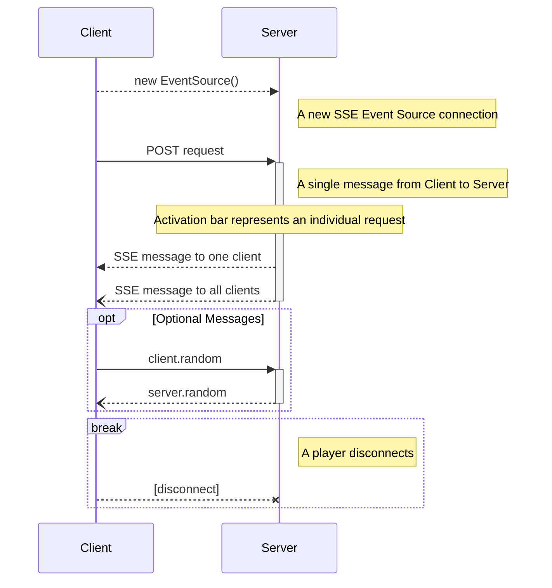
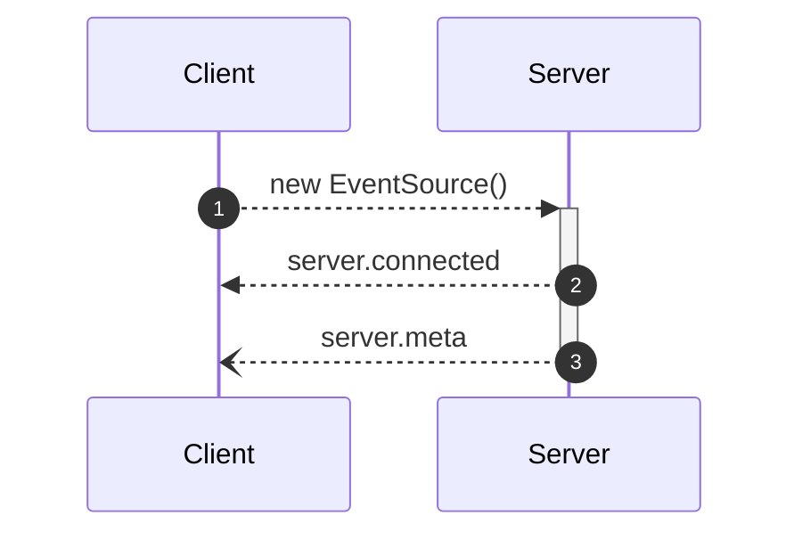
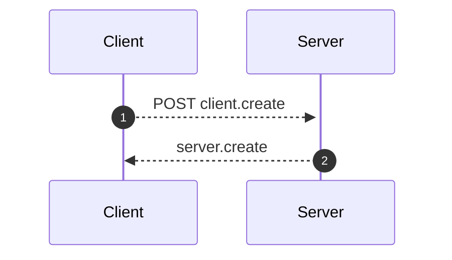
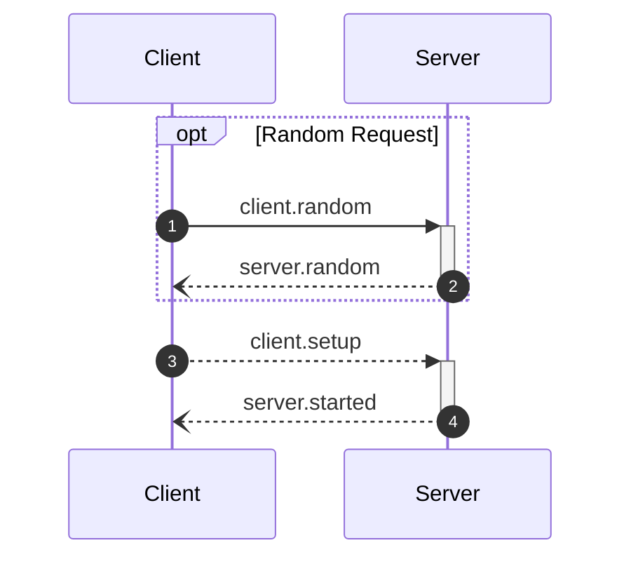
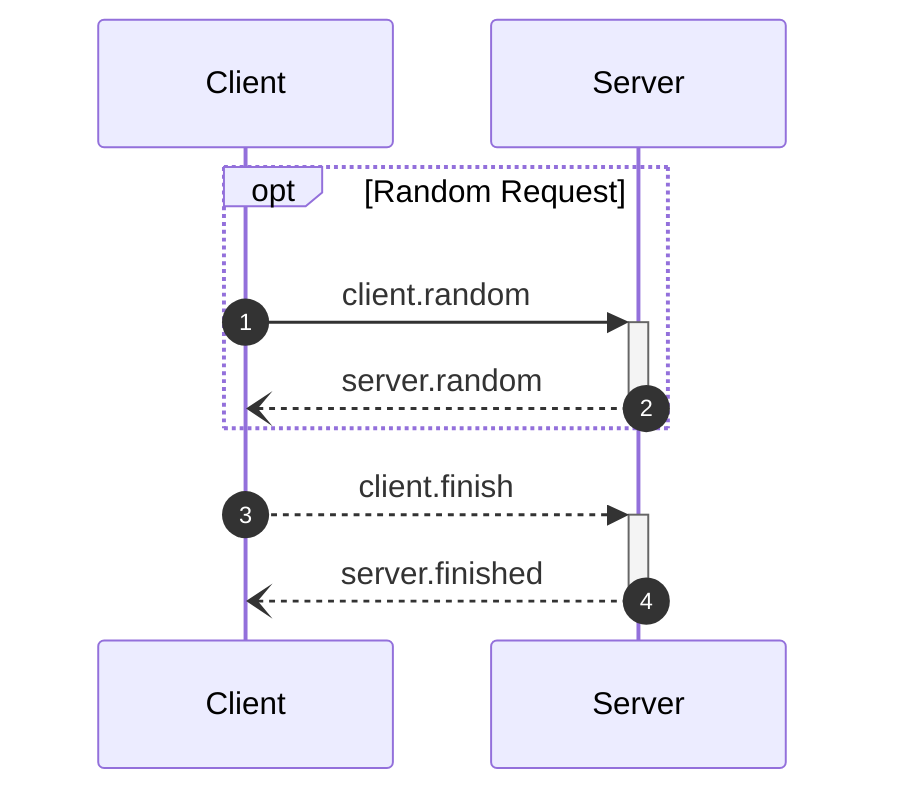
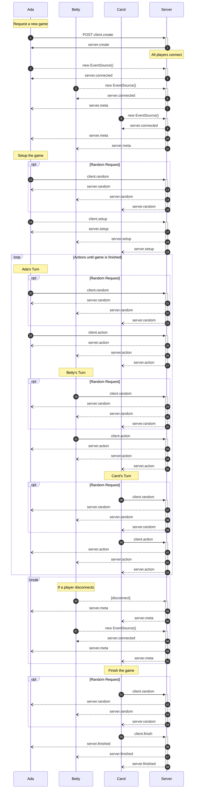

# Sequences

## Legend

```mermaid
sequenceDiagram
    participant C as Client
    participant S as Server
    C-->>S: new EventSource()
    Note right of S: A new SSE Event Source connection
    C->>+S: POST request
    Note right of S: A single message from Client to Server
    Note over S: Activation bar represents an individual request
    S-->>C: SSE message to one client
    S--)-C: SSE message to all clients
    opt Optional Messages
        C->>+S: client.random
        S--)-C: server.random
    end
    break
        Note right of S: A player disconnects
        C--xS: [disconnect]
    end
```

## Connected

```mermaid
sequenceDiagram
    autonumber
    participant C as Client
    participant S as Server
    C-->>+S: new EventSource()
    S-->>C: server.connected
    S--)-C: server.meta
```

## Create

```mermaid
sequenceDiagram
    autonumber
    participant C as Client
    participant S as Server
    C-->>+S: POST client.create
    S-->>C: server.create
```

## Setup

```mermaid
sequenceDiagram
    autonumber
    participant C as Client
    participant S as Server
    opt Random Request
        C->>+S: client.random
        S--)-C: server.random
    end
    C-->>+S: client.setup
    S--)-C: server.started
```

## Action

```mermaid
sequenceDiagram
    autonumber
    participant C as Client
    participant S as Server
    opt Random Request
        C->>+S: client.random
        S--)-C: server.random
    end
    C->>+S: client.action
    S--)-C: server.action
```

## Finish

```mermaid
sequenceDiagram
    autonumber
    participant C as Client
    participant S as Server
    opt Random Request
        C->>+S: client.random
        S--)-C: server.random
    end
    C-->>+S: client.finish
    S--)-C: server.finished
```

## Full Example

```mermaid
sequenceDiagram
    autonumber
    participant A as Ada
    participant B as Betty
    participant C as Carol
    participant S as Server
    Note over A: Request a new game
    A->>+S: POST client.create
    S->>-A: server.create

    Note over S: All players connect
    A-->>+S: new EventSource()
    S-->>-A: server.connected

    B-->>+S: new EventSource()
    S-->>B: server.connected
    S--)-A: server.meta

    C-->>+S: new EventSource()
    S-->>C: server.connected
    S--)A: server.meta
    S--)-B: server.meta

    Note over A: Setup the game
    opt Random Request
        A->>+S: client.random
        S--)A: server.random
        S--)B: server.random
        S--)-C: server.random
    end
    A-->>+S: client.setup
    S--)A: server.setup
    S--)B: server.setup
    S--)-C: server.setup

    loop Actions until game is finished
        Note over A: Ada's Turn
        opt Random Request
            A->>+S: client.random
            S--)A: server.random
            S--)B: server.random
            S--)-C: server.random
        end
        A->>+S: client.action
        S--)A: server.action
        S--)B: server.action
        S--)-C: server.action

        Note over B: Betty's Turn
        opt Random Request
            B->>+S: client.random
            S--)A: server.random
            S--)B: server.random
            S--)-C: server.random
        end
        B->>+S: client.action
        S--)A: server.action
        S--)B: server.action
        S--)-C: server.action

        Note over C: Carol's Turn
        opt Random Request
            C->>+S: client.random
            S--)A: server.random
            S--)B: server.random
            S--)-C: server.random
        end
        C->>+S: client.action
        S--)A: server.action
        S--)B: server.action
        S--)-C: server.action
    end

    break
        Note over B: If a player disconnects
        B--x+S: [disconnect]
        S--)A: server.meta
        S--)-C: server.meta

        B-->>+S: new EventSource()
        S-->>B: server.connected
        S--)A: server.meta
        S--)-C: server.meta
    end

    Note over C: Finish the game
    opt Random Request
        C->>+S: client.random
        S--)A: server.random
        S--)B: server.random
        S--)-C: server.random
    end
    C-->>+S: client.finish
    S--)A: server.finished
    S--)B: server.finished
    S--)-C: server.finished
```
