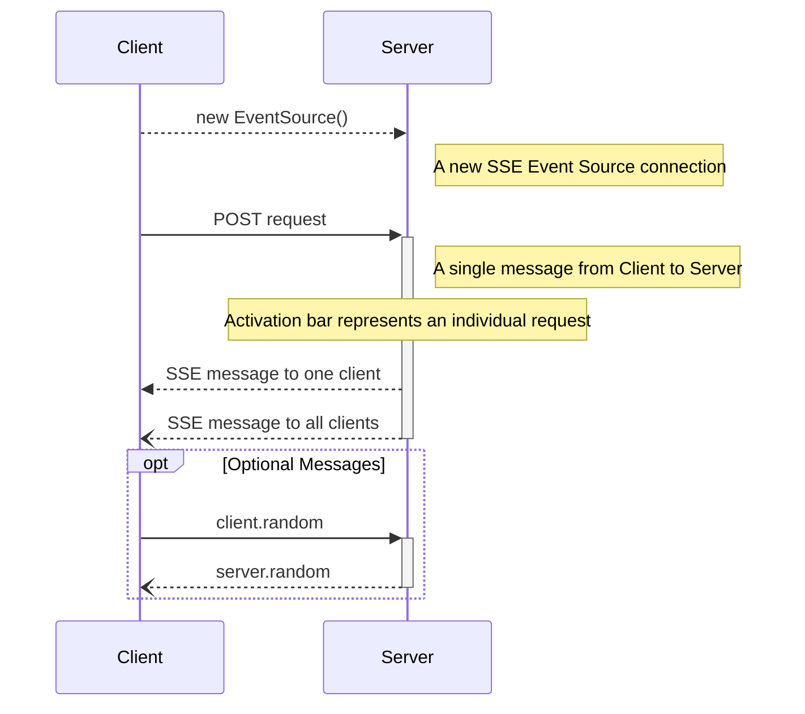
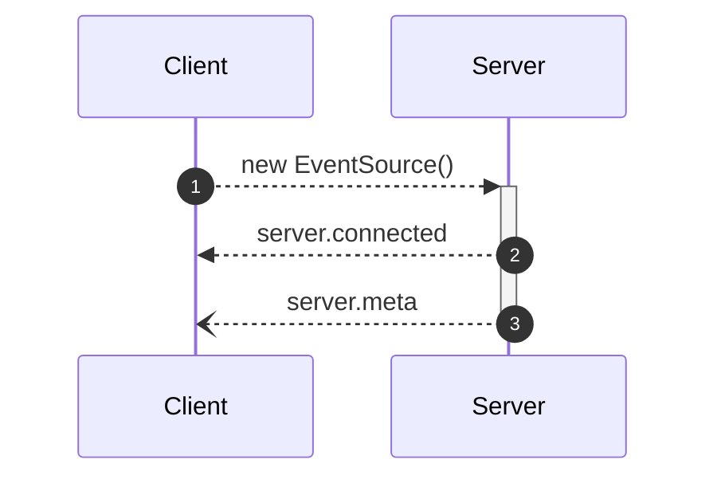
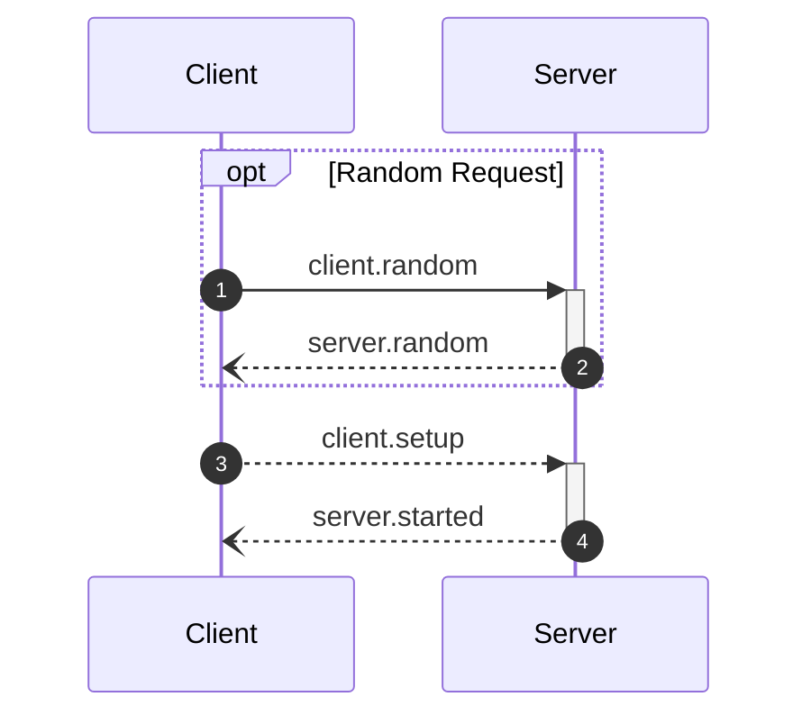
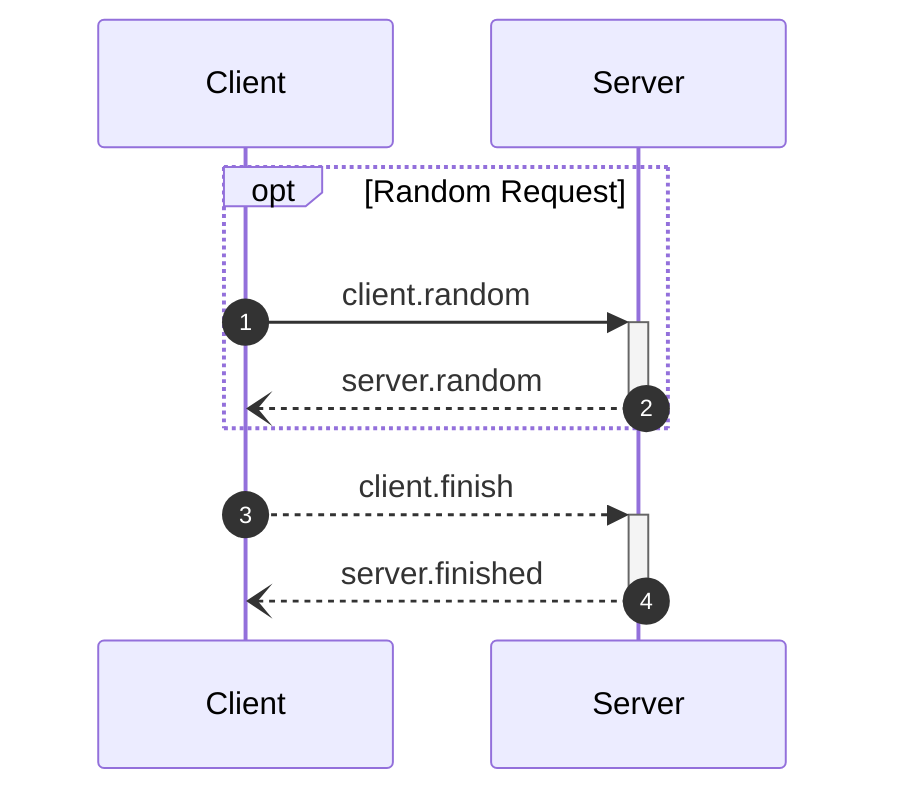

# Sequences

## Legend

```mermaid
sequenceDiagram
    participant C as Client
    participant S as Server
    C-->>S: new EventSource()
    Note right of S: A new SSE Event Source connection
    C->>+S: POST request
    Note right of S: A single message from Client to Server
    Note over S: Activation bar represents an individual request
    S-->>C: SSE message to one client
    S--)-C: SSE message to all clients
    opt Optional Messages
    C->>+S: client.random
    S--)-C: server.random
    end
```

## Connecting

```mermaid
sequenceDiagram
    autonumber
    participant C as Client
    participant S as Server
    C-->>+S: new EventSource()
    S-->>C: server.connected
    S--)-C: server.meta
```

## Setup

```mermaid
sequenceDiagram
    autonumber
    participant C as Client
    participant S as Server
    opt Random Request
    C->>+S: client.random
    S--)-C: server.random
    end
    C-->>+S: client.setup
    S--)-C: server.started
```

## Action

```mermaid
sequenceDiagram
    autonumber
    participant C as Client
    participant S as Server
    opt Random Request
    C->>+S: client.random
    S--)-C: server.random
    end
    C->>+S: client.action
    S--)-C: server.action
```

## Finish

```mermaid
sequenceDiagram
    autonumber
    participant C as Client
    participant S as Server
    opt Random Request
    C->>+S: client.random
    S--)-C: server.random
    end
    C-->>+S: client.finish
    S--)-C: server.finished
```
