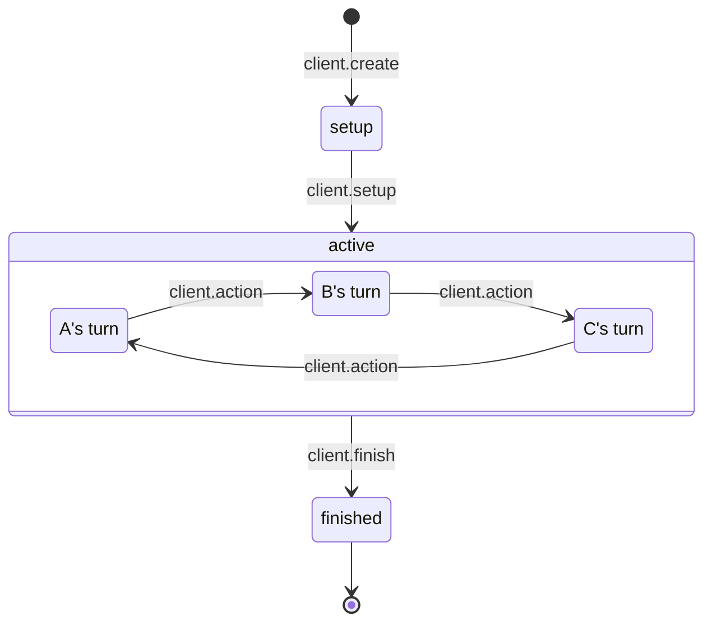

# Game

## States

The game can be in one of three states:

- **setup** The game has just been created and is waiting for a `client.setup`
  message to start.
- **active** The game has been setup and has an initial state and is waiting for
  player actions to come in.
- **finished** This game has been marked finished, no more actions are
  valid. The game state will contain any results.

### Diagram

